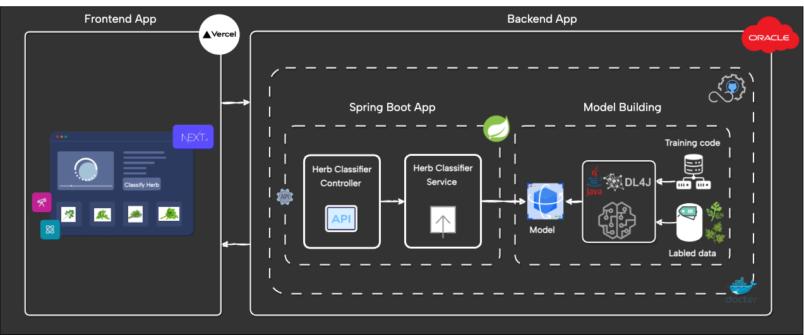

# 🌿🌱 Herb Classifier : Coriander VS Parsley  🌿🌱

Herb Classifier is a Spring Boot application that classifies images of coriander and parsley herbs using a deep learning model built with DeepLearning4j.

## 🖥️ Frontend Application

* The frontend application is built with NextJs and TailwindCSS. Check the [website](https://herb-classifier.vercel.app/)
* The frontend application repository is [here](https://github.com/bouazzaayyoub/herb-classifier-front)

## 📐 Diagram of the application architecture

## 📚 Table of Contents

- [Getting Started](#-getting-started)
- [Prerequisites](#-prerequisites)
- [Installing](#-installing)
- [Deployment](#-deployment)
- [Built With](#-built-with)
- [Owner and Contributors](#-owner-and-contributors)
- [License](#-license)
- [Support](#-support)
- [Key Features](#-key-features)

## 🚀 Getting Started

These instructions will get you a copy of the project up and running on your local machine for development and testing purposes.

### 📋 Prerequisites

- Java 17
- Maven
- Docker

### 🔧 Installing

1. Clone the repository
2. Navigate to the project directory
3. Run `mvn clean install`
4. Build docker image `docker build -t myusername/herb-classifier-api:version -f Dockerfile .

## 🚢 Deployment

This application is deployed using Docker. The CI/CD pipeline is configured in `.github/workflows/main.yml`.

## 🛠️ Built With

- [Spring Boot](https://spring.io/projects/spring-boot) - The web framework used
- [Maven](https://maven.apache.org/) - Dependency Management
- [DeepLearning4j](https://deeplearning4j.org/) - Used for image classification
- [Docker](https://www.docker.com/) - Used for deployment
- [Github Actions](https://docs.github.com/en/actions) - Used for CI/CD
- [NextJs](https://nextjs.org/) - Used for the frontend application
- [TailwindCSS](https://tailwindcss.com/) - Used for styling the frontend application

## 👥 Owner and Contributors

- **_`Owner`_** : **Adnane Miliari** - *Backend Engineer* - [miliariadnane](https://github.com/miliariadnane)
- **_`Contributors`_** : 
  - **Ayoub Bouazza** - *Frontend Engineer 🎨* - [bouazzaayyoub](https://github.com/bouazzaayyoub)
  - **Mohammed Daoudi** - *DevOps Engineer 🐬* - [Iduoad](https://github.com/Iduoad)

## 📝 License

This project is licensed under the MIT License - see the [LICENSE.md](LICENSE.md) file for details

## 🌟 Support

> If you find this project useful or interesting, please consider giving it a star ⭐ on GitHub. Your support is greatly appreciated! 
> Also, if you have a moment, don't forget to make a duaa 🤲 for us. Thank you for your support!

## ⚙️ Key Features

- [x] Deep learning model built with DeepLearning4j 🧠
- [x] REST API 🌐
  - [x] Upload an image 🖼️
  - [x] Classify the image 🔍
  - [x] Display the classification result 📊
- [x] Dockerized application 🐳
- [x] CI/CD pipeline - Github Actions 🤖
- [x] NextJs frontend application
    - [x] Home page 🏠
    - [x] Upload page 📤
    - [x] About page ℹ️
- [ ] Mobile responsive 📱
